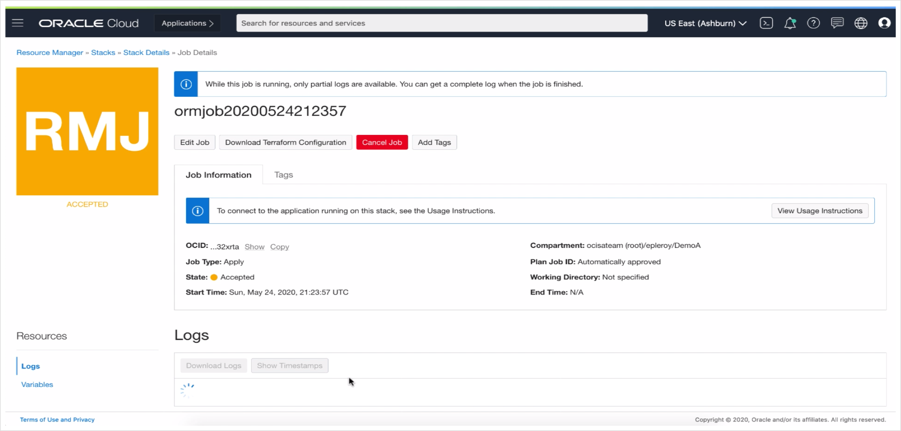

### WebLogic Migration to Oracle Cloud Infrastructure 

## Objective
이 과정에서는 OCI Marketplace 에서 WebLogic을 프로비저닝 하고 로컬 WebLogic 도메인을 Oracle Cloud Infrastructure로 마이그레이션 합니다.

- Docker / docker-compose를 사용하여 프로비저닝 된 로컬 데이터베이스가 지원하는 애플리케이션으로 로컬 WebLogic 도메인으로 시작합니다.
- 마켓 플레이스에서 WebLogic Server를 프로비저닝하고 마이그레이션을 수행하기 위해 OCI 테넌시를 준비합니다.
- 마켓 플레이스를 사용하여 OCI에 새로운 WebLogic 도메인을 프로비저닝합니다.
- Database Cloud를 사용하여 데이터베이스를 프로비저닝하고, 로컬 애플리케이션 데이터베이스를 마이그레이션합니다.
- 로컬 데이터베이스 스키마를 백업하고 파일을 OCI에서 프로비저닝 된 DB로 이동 한 후 Import해서 DataPump를 사용하여 로컬 애플리케이션 데이터베이스를 OCI DB로 마이그레이션 합니다.
- 마지막으로 WDT (Weblogic Deploy Tooling)를 사용하여 WebLogic 도메인을 마이그레이션합니다. 로컬 도메인을 발견하고 새 도메인을 대상으로 모델 파일을 변경 한 후 OCI에서 새 도메인을 업데이트합니다.


**프로비저닝 시간을 포함하여 전체 프로세스를 완료하는 데 3 시간 정도 소요됩니다.**

## Requirements

### 1) Software, credentials and accounts

- On-Premise 환경을 실행하기 위하여 로컬에 Docker가 설치되어 있어야 합니다.</br>
  Docker 다운로드 : <a href="https://docs.docker.com/get-docker/" target="_blank">https://docs.docker.com/get-docker/</a>

- Docker Hub 계정, Docker image를 다운로드 받기 위해 필요.</br>
  Sign up here: <a href="https://hub.docker.com/signup" target="_blank">https://hub.docker.com/signup</a>

- Oracle Container Registry 계정 (= OCI 계정)</br>
  <a href="https://container-registry.oracle.com" target="_blank">https://container-registry.oracle.com</a>

- Oracle Cloud Infrastructure 계정</br>
  <a href="https://www.oracle.com/cloud/free/" target="_blank">https://www.oracle.com/cloud/free/</a>

### 2) Application 소스 코드

**Lab에 필요한 소스코드를 다운로드** <a href="./weblogic-to-oci.zip" target="_blank">다운로드</a></br>
또는 다음의 주소에서 다운로드 <a href="https://github.com/oracle/learning-library/raw/master/developer-library/weblogic-to-oci/workshop/weblogic-to-oci.zip" target="_blank">https://github.com/oracle/learning-library/raw/master/developer-library/weblogic-to-oci/workshop/weblogic-to-oci.zip</a>

### 3) private docker images 받기

이 리포지토리는 Oracle Docker 이미지를 사용하는데, 라이센스가 부여 된 조건을 확인한 후 가져와야 합니다.

- Docker Hub에 로그인하여 Weblogic 이미지 영역으로 이동하십시오.</br>
  <a href="https://hub.docker.com/_/oracle-weblogic-server-12c" target="_blank">https://hub.docker.com/_/oracle-weblogic-server-12c</a>
  
  - Click **Proceed to Checkout**
    정보를 입력하고 라이센스 약관에 동의 한 후 **콘텐츠를 받으십시오.**.

  - 그리고, 다음과 같이 이미지를 받습니다 : 

    ```bash
    <copy>
    docker pull store/oracle/weblogic:12.2.1.4
    </copy>
    ```

- **Oracle Container Registry**에 로그인을 해서, 다음 위치에서 데이터베이스 이미지의 라이센스 조항에 동의하십시오.</br>
  <a href="https://container-registry.oracle.com/pls/apex/f?p=113:4:102331870967997::NO:::" target="_blank">https://container-registry.oracle.com/pls/apex/f?p=113:4:102331870967997::NO:::</a>

  - 그리고, 다음과 같이 이미지를 받습니다 :

    ```bash
    <copy>
    docker pull container-registry.oracle.com/database/enterprise:12.2.0.1
    </copy>
    ``` 

- **Instant Client**로 이동해서, 다음 페이지에서 SQL Plus 클라이언트의 라이센스 조항에 동의하십시오.</br>
  <a href="https://container-registry.oracle.com/pls/apex/f?p=113:4:103193800236962" target="_blank">https://container-registry.oracle.com/pls/apex/f?p=113:4:103193800236962</a>

  - 그리고, 다음과 같이 이미지를 받습니다 :

    ```bash
    <copy>
    docker pull store/oracle/database-instantclient:12.2.0.1
    </copy>
    ```

# WebLogic Migration Lab steps

## Step 1: 로컬 ('on-premises') 환경 Setup

Code를 받고 Docker Image를 얻기 위해서는 위의 Requirements를 확인하세요

### 1.1) Local 환경 시작

On-premise 환경을 대신해서 로컬 환경을 시작하도록 하겠습니다. 
우선 다음과 같이 실행하십시오.
```
<copy>
cd on-prems-setup
docker-compose up -d
</copy>
```
일부 이미지는 빌드해야 하므로 이 단계는 몇 분이 걸릴 수 있습니다.

실행도중 다음과 같은 오류 메시지가 표시되면
```
pull access denied for store/oracle/database-instantclient, repository does not exist or may require 'docker login': denied: requested access to the resource is denied
```
이미지에 대해서 * 약관 및 조건 *을 수락하지 않았음을 의미합니다.

이전 단계의 레지스트리 및 이미지 페이지로 이동하여 승인 단계를 수행한 후에 위에서 설명한대로 이미지를 pull 하십시오.

### 1.2) 로컬 환경이 작동하고 있는지 확인하십시오

**도메인을 시작하고 실행하는 데 몇 분이 걸릴 수 있습니다.**, Weblogic 컨테이너는 데이터베이스가 준비되고 스키마가 작성되기를 기다립니다.

모두 실행이 되면, 콘솔화면에 접근하실 수 있게 됩니다.
<a href="http://localhost:7001/console" target="_blank">http://localhost:7001/console</a> a
WebLogic 관리자 계정은 `weblogic` 이고 비밀번호는 `welcome1` 입니다.

초기화 상태를 확인하려면 다음을 실행하여 `on-prems-setup_oracledbinit_1` docker 컨테이너의 실행이 완료되었는지 확인할 수 있습니다.

```
<copy>
docker ps
</copy>
```
다음의 상태는 초기화를 수행하는 컨테이너가 정상적으로 종료되었으며 시스템이 모두 준비되어 있는 것을 의미합니다.

```
CONTAINER ID        IMAGE                      COMMAND                  CREATED             STATUS                PORTS                                                                          NAMES
bf43e3bd5a78        on-prems-setup_oracledb    "/bin/sh -c '/bin/ba…"   7 days ago          Up 7 days (healthy)   127.0.0.1:1521->1521/tcp, 127.0.0.1:5000->5000/tcp, 5500/tcp                   on-prems-setup_oracledb_1
38bcbb1555b8        on-prems-setup_wls_admin   "/u01/oracle/startNM…"   7 days ago          Up 7 days             127.0.0.1:7001->7001/tcp, 127.0.0.1:7003->7003/tcp, 127.0.0.1:7005->7005/tcp   on-prems-setup_wls_admin_1
```

'on-prems-setup_oracledbinit'라는 컨테이너가 표시되면 초기화가 여전히 진행 중임을 의미합니다.

setup 도중에 발생한 문제를 해결하기 위해서는 다음과 같이 도커 컨테이너의 로그를 확인하십시오.

```bash
<copy>
docker logs -t on-prems-setup_wls_admin_1
</copy>
```
또는
```bash
<copy>
docker logs -t on-prems-setup_oracledb_1
</copy>
```

다음 단계로 진행하기 전에 로컬 환경이 올바르게 배치되었는지 확인을 하겠습니다.


** SimpleDB ** 애플리케이션이 다음 주소에서 실행 중이어야 합니다. <a href="http://localhost:7003/SimpleDB/" target="_blank">http://localhost:7003/SimpleDB/</a> 또는 <a href="http://localhost:7005/SimpleDB/" target="_blank">http://localhost:7005/SimpleDB/</a>

정상적으로 실행이 되면 아래와 같이 보입니다.


### 1.3) SSH key 생성

WebLogic 서버 및 OCI의 데이터베이스와 통신하려면 SSH 키 쌍이 필요합니다. 해당 리소스를 프로비저닝 할 때 공개 키를 제공해야합니다.

도커 컨테이너에서 모든 명령을 실행하므로 두 컨테이너 내부의 `~ / .ssh /`폴더가 마운트되고 공유되어 외부에서도 액세스 할 수 있습니다.

이 폴더에 SSH 키 페어를 만듭니다

- Oracle Database 컨테이너에 들어가십시오.

```bash
<copy>
docker exec -it on-prems-setup_oracledb_1 /bin/bash
</copy>
```

- SSH keypair 를 생성합니다.

```bash
<copy>
ssh-keygen
</copy>
```
모든 프롬프트에서`Enter` (기본값)를 누르십시오.

- `./on-prems-setup/common/` 폴더 안에 두 개의 파일 'id_rsa'와 'id_rsa.pub'이 생성된 것을 확인하셔야 합니다.

  `id_rsa`는 개인 키이며, 절대 공유해서는 안되며, 해당 공개 키 `id_rsa.pub`로 프로비저닝 된 OCI 리소스에 연결해야합니다.

   이 키는 온-프레미스 환경에 사용되는 도커 컨테이너 내의 기본 SSH 키입니다. 컨테이너 외부에서 OCI 리소스에 SSH를 연결하려면 `-i <path-to-id_rsa>/id_rsa`와 함께 ssh 명령에서 개인 키를 ID 파일로 사용해야 합니다.

**Note:** 이 작업은 한 번만 수행하면됩니다. 다시 실행하면 새 키가 이전 키를 덮어 쓰고 해당 키로 프로비저닝 된 모든 리소스에 액세스 할 수 없게됩니다.

## Step 2: OCI account 준비

이런 전제 조건은 WebLogic 스택을 배치하기 위해 한 번만 수행하면 됩니다.

OCI 계정에 로그인
### 2.1) **Vault** 생성

- **Security -> Vault** 로 이동하세요

   

- WebLogic을 배포하려는 Compartment(구획)에 있는지 확인하십시오.

- **Create Vault** 클릭

   

- Valut 이름을 'WebLogic Vault' 나 아무 이름으로 지정하십시오. `private` 옵션이 **확인되지 않음**인지 확인하고 **Vault 생성**을 클릭하십시오.

   

### 2.2. Vault 안에서 **Key** 생성

- Vault가 생성되면 Valut를 클릭하십시오.

   

- **Create Key** 를 클릭하세요

   

- 이름을 `WebLogicKey` 라고 하거나 아무 이름으로 입력한 후 **Create Key** 를 누릅니다.

   

### 2.3) WebLogic 관리자 비밀번호를 위한 **Secret** 생성

- key 가 생성이 되고 나서 , **Secrets** 을 클릭합니다.

   

- 그리고 **Create Secret** 를 클릭하세요.

  

- **Secret**의 이름을 `WebLogicAdminPassword`로 지정하고 이전 단계에서 생성 된 `WebLogicKey`를 **Encryption Key** 로 선택한 다음 기본 `plaintext` 옵션을 유지하고 `welcome1` 또는 WebLogic 비밀번호를 입력하십시오 (텍스트 필드에 최소 8 자, 대문자 또는 숫자 1 개)를 입력하고 **Create Secret**을 클릭하십시오.

  

- 생성한 `WebLogicAdminPassword` **Secret**을 클릭하고 **OCID** 를 복사합니다.

   

자, 이제 시작할 준비가 되었습니다.

**참고:**
JRF 도메인 (여기서는 해당되지 않음)을 마이그레이션하는 경우 마켓 플레이스에서 WebLogic 도메인을 프로비저닝하기 전에 서브넷 및 보안 목록과 운영 데이터베이스뿐만 아니라 가상 클라우드 네트워크를 프로비저닝 해야 합니다.

## Step 3: WebLogic infrastructure 프로비저닝

### 3.1) 마켓플레이스에서 Stack을 Provision

- **Solutions and Platforms** 으로 이동

  

- 검색 Input 박스에서, "`weblogic`" 으로 검색하세요. 이번 Lab에서는 **WebLogic Enterprise Edition UCM** 을 사용할 것입니다.

   

- **Compartment**를 사용하고자 하는 곳으로 선택합니다., **기본 WebLogic 버전** 을 선택하고, License agreement 를 체크하고, **Launch the Stack** 을 클릭하세요.

   

- Stack **Name** 을 입력하고 **Next**를 클릭하세요.

   

   

- **Resource Name Prefix** 를 입력합니다.

  모든 리소스 (도메인, 관리 서버, 관리 서버, 클러스터, 머신 등)의 이름에서 이 prefix를 사용합니다.

  이 워크샵의 다음 단계에서는 리소스 이름 접두사가 'nonjrf'라고 가정하므로 이 이름을 사용하시기 바랍니다.

  

- **Shape** 를 선택하세요.

   실제 운영 환경에서는 한개의 Managed Server의 로드를 처리하기에 적합한 Shape을 선택하십시오. 이번 Lab에서는 Trial 계정을 사용하고 있으므로 **VM.Standard.1** Shape이나 테넌시에서 사용 가능한 것으로 나오는 Shape을 선택하십시오.

  

   Shape 가용성을 확인하려면 다른 탭에서 **Governance -> Limits and Quotas** 으로 이동하여 사용 가능한 특정 Shape가 있는지 확인하십시오.

- **SSH key**

   SSH를 통해 WebLogic 서버에 연결하려면 서버가 컴퓨터를 식별하는 데 사용할 공개 키를 제공해야합니다. 도커 컨테이너 내부에서 다양한 명령이 실행되므로 컨테이너에서 생성된 키를 제공해야합니다.

  

  공개 키 내용을 확인하기 위해 도커 컨테이너 내부에서 다음 명령을 사용하십시오.
   ```
   <copy>
   cat ~/.ssh/id_rsa.pub
   </copy>
   ```
   명령 출력 (전체 멀티 라인 출력)을 복사하여 SSH 키 폼 필드에 붙여 넣으십시오.

   출력은 다음과 같습니다.

   ```bash
   ssh-rsa AAAAB3NzaC1yc2EAAAADAQABAAABAQDlkF23qLyfimJ9Vp4D9psp7bDOB8JvtY/pfYzFxIA2E4v6or+XhvMW5RDhX9Ba54zQNNDLvwUhStdXKkiMXJtEQJarFn45pGy/lyUQKFJolAdHBrXJsg5XWn4DxCFeQUQe1szVfmwDLAktAS14r5g76h3CcA8Kk/cNVqevxVChyejuuOdtAMoriIC8uKV+535qPs/GMiu0zR9aW4w1VodL5eHnXjqdgp8Fr21dVUVQ6of+s/ws0zlQUwghrNguDUqlggzG2mpLBHExypxCrJYmsb05uYjjqVlC3YCatj4nJTIHKLCFiYVY/b8AFkqwXV9EYlja5bjTmunM847dcR8H oracle@ad753161734c
   ```
   **참고:** 위의 예를 실제 키로 사용하시면 안됩니다.

- **Availability Domain** 선택

  

- **Node count** 선택. 이번 Lab에서는 2개의 Node를 사용할 것입니다.

  

- WebLogic 관리자 이름을 `weblogic`의 기본값으로 유지합니다

  

- **Secret OCID for WebLogic Admin Password**의 Step 2.3)에서 생성한  **Secret** 의 **OCID**를 붙여 넣기 합니다.

  

- **WebLogic Server Advanced Server Configuration** 체크박스를 **체크합** 니다.
   여기에서 모든 기본 포트를 볼 수 있습니다. 기본 포트는 그대로 유지됩니다.

  

- **Advanced** 에서, **Provision the Sample Application** 를 **체크하지 않습니다**.: 도메인을 마이그레이션 할 예정이므로 깨끗한 도메인부터 시작해야합니다.

  

- **WebLogic Network** 에서는, compartment가 맞는지 확인하세요.

  

- **Create New VCN** 를 선택하세요

  

- VCN **이름은** `wls` 으로 합니다.

  

- VCN CIDR 는 **디폴트**로 합니다.
   
  

   참고 : VPN 또는 FastConnect를 통해 연결된 온-프레미스 도메인에서 마이그레이션하는 경우 CIDR 블록이 로컬 네트워크와 충돌하지 않도록 다르게 해야 합니다.

- **Subnet은 Default로 유지** : 

   Stack이 자동으로 subnet을 생성하게 됩니다.

  

- **Provision Load Balancer** 를 **체크** 하고 나머지는 Default로 합니다.

  

- IDCS **체크해제** 를 유지합니다.

  

- **No Database** 가 선택되도록 합니다.

  

- 옵션으로 Tags를 입력합니다.

  

- **Next** 클릭합니다.

  

- 마지막으로 **Create**를 클릭합니다.

  

- 스택은 **Resource Manager**를 사용하여 프로비저닝 됩니다. 7-15 분 정도 소요가 되게 됩니다.

  


스택이 프로비저닝되면 WebLogic Admin 서버의 URL 및 IP에 대한 정보를 Logs 또는 **Outputs** 왼쪽 메뉴에서 찾을 수 있습니다.

### 3.2) 필요한 WebLogic stack 정보 수집

  

- 나중에 사용할 수 있도록 **WebLogic Admin Server 콘솔 URL**에서 **WebLogic Admin Server Public IP 주소**를 기록하세요.

- **Load Balancer IP**도 기록합니다.

브라우저에서 **WebLogic Admin Console URL**을 복사하여 붙여넣고 프로비저닝 된 WebLogic 도메인을 확인 할 수 있습니다. **Deploy**에는 애플리케이션이 현재 없고 **서비스->데이터 소스** 메뉴에도 데이터 소스가 없습니다.


## Step 4: OCI에 Database 프로비저닝

WebLogic 인스턴스가 프로비저닝되는 동안 VCN만 프로비저닝이 되면, 데이터베이스 프로비저닝으로 진행할 수 있습니다.

애플리케이션 데이터베이스를 프로비저닝하기 전에 필요한 **Security Lists**을 사용하여 **Database System**에 **Private Subnet**을 프로비저닝하여 필요한 포트를 열어야 합니다.

- Database port : 1521
- SSH port : 22

### 4.1) 데이터베이스 서브넷에 대한 Security List 작성

이 섹션에서는 포트 1521 (Oracle 데이터베이스 기본 포트)의 데이터베이스 서브넷에 도달 할 수 있도록 WebLogic 서브넷에 대한 Security List을 작성합니다.

- WebLogic이 프로비저닝된 Compartment에서 **Networking -> Virtual CLoud Network**으로 이동합니다.

  

- 스택에 의해 생성 된 VCN을 클릭하십시오. 동일한 명명 규칙을 사용하는 경우 'nonjrf-wls'라고 합니다.

  

  WebLogic 서버 인스턴스가 퍼블릭 서브넷에서 프로비저닝 된 이후 두 퍼블릭 서브넷 인 `nonjrf-lb-subnet` 및 `nonjrf-wls-subnet`이 모두 있어야 합니다.

- `nonjrf-wls-subnet`의 CIDR 블록 (10.0.3.0/24 여야 함)을 복사하고 왼쪽 메뉴에서 **Security Lists**을 클릭하십시오.

  

- **Create Security List** 를 클릭

  

- **이름을** `nonjrf-db-security-list` 로 입력

  

- **Additional Ingress Rule** 클릭

  

- **Source CIDR**에는, `nonjrf-wls-subnet`에서 복사한 `10.0.3.0/24`를 붙여 넣기 합니다. **Destination Port Range**로는 **1521** 입력

  

- **Additional Ingress Rule** 클릭하고, **Source CIDR**에는 `0.0.0.0/0`입력하세요. **Destination Port Range** 는 `22`를 입력해서 외부로부터의 SSH 포트를 오픈합니다.

  

### 4.2) Database subnet 생성

- 왼쪽메뉴에서 **Subnets**  클릭

  

- **Create Subnet** 클릭

  

- **Name** 에 `nonjrf-db-subnet` 입력

  

- **Subnet Type**은 Default로 하고 CIDR block 에  `10.0.5.0/24` 입력

  

- **Routing Table**은 `Default Routing Table for nonjrf-wls`을 선택

  

- **Private Subnet** 선택

  

- DNS Resolution은 Default를 유지하고 **DHCP Options** 으로 `Default DHCP Options for nonjrf-wls` 선택

  

- **Security List**는 `nonjrf-db-security-list` 선택

  

- **Create Subnet** 클릭

  

### 4.3) Database System 프로비저닝

- **Database -> Bare Metal, VM and Exadata** 이동

  

- **Create DB System** 클릭

  

- DB subnet을 생성한 **Compartment**에 있는지 확인, **Database System**의 이름 입력

  

- Availability Domain을 선택하고, **Virtual Machine**을 선택 후 가용한 **Shape** 선택

  

- **Total node count** 와 **Database Edition** 는 Default로 유지

  

- **Logical Volume Manager**  선택

  

- **Storage** Defualt 유지

  

- 이전에 생성한 **SSH public key** **업로드**
  컨테이너에서 생성된 키는 다음 폴더에서 확인할 수 있습니다 `./on-prems-setup/common`

  

- **License Included** 디폴트 유지

  

- **Virtual cloud network**에서 `nonjrf-wls`를 선택하고, **Client subnet** 은`nonjrf-db-subnet`으로, **Hostname prefix** 은 `db` 를 입력하세요.

  

- **Next**를 클릭

- on-premise에서의 이름과 동일하게 Database 이름으로 `RIDERS` (정상적인 migration을 위해 필요)

  

- **Database version** 으로 19c 선택

  

- on premise와 같이 **PDB** 이름으로 `pdb` 입력

  

- on-premise와 동일하게 **SYS Database password**를 `YpdCNR6nua4nahj8__` 으로 입력
이 암호는 `on-prems-setup/weblogic` 폴더의 `env` 파일의 `DB_PWD` 에서 확인할 수 있습니다.

  

- **Workload type** 을  **Transaction Processing**와 **Backup** 을 디폴트로 유지하고, **Create DB System**을 클릭합니다.

  

이 과정은 20 분에서 40분 정도 소요됩니다.

  

### 4.4) OCI database 정보 수집

데이터베이스 시스템이 프로비저닝이 완료되면

- `노드`왼쪽 메뉴로 이동하여 나중에 사용하도록 프로비저닝 된 노드의 **private IP address**를 확인하십시오.

  

- **DB Connection** 으로 이동

  

- **DB connection string** 복사 (뒤에서 사용)

  

## Step 5: 데이터베이스 마이그레이션

DataPump는 온-프레미스에서 OCI로 데이터베이스를 마이그레이션하는 데 사용됩니다.

DataPump 내보내기 기능은 사용자 스키마의 DDL + 데이터 덤프를 생성 한 다음 대상 데이터베이스로 전송됩니다.이 데이터베이스는 DataPump 가져 오기 기능을 사용하여 스키마를 생성하고 데이터를 가져옵니다.

### 5.1) 다음을 사용하여 데이터베이스 컨테이너 안에 쉘을 가져옵니다.


```
<copy>
docker exec -it on-prems-setup_oracledb_1 /bin/bash
</copy>
```
Note: SSH 키 생성 단계에서 DB 컨테이너 내부에 이미 있어야 하므로 컨테이너를 종료하지 않으면 위 단계를 건너 뛸 수 있습니다.

그리고 나서 `/datapump` 폴더로 이동합니다.
```
<copy>
cd ~/datapump
</copy>
```

### 5.2) `datapump_export.sh` script

스크립트 자체는 스크립트의 기능을 설명하기 위해 주석 처리됩니다.

백업 할 디렉토리를 설정하고 datapump `expdp` export 명령을 사용하여 애플리케이션이 의존하는 스키마인 RIDERS 스키마를 덤프합니다.

<details><summary><code>datapump_export.sh</code> script 보기</summary>

```bash
EXPORT_DB_DIRNAME=export

# all other variables are from the local environment

# clear the folder and recreate
rm -rf ~/datapump/export && mkdir -p ~/datapump/export

# drop directory if it exists
echo "DROP DIRECTORY ${EXPORT_DB_DIRNAME};" | sqlplus system/${DB_PWD}@${DB_HOST}:${DB_PORT}/${DB_PDB}.${DB_DOMAIN}

# create a directory object in the DB for export with datapump, pointing to the folder created above
echo "CREATE DIRECTORY ${EXPORT_DB_DIRNAME} AS '/home/oracle/datapump/export/';" | sqlplus system/${DB_PWD}@${DB_HOST}:${DB_PORT}/${DB_PDB}.${DB_DOMAIN}

# export the schema 'RIDERS' with datapump, which is our user schema with the Tour de France Riders data
expdp system/${DB_PWD}@${DB_HOST}:${DB_PORT}/${DB_PDB}.${DB_DOMAIN} schemas=RIDERS DIRECTORY=${EXPORT_DB_DIRNAME}
```
</details>

### 5.2.1) `datapump_export.sh` script 실행

```
<copy>
./datapump_export.sh
</copy>
```

결과는 아래와 같습니다.

  


### 5.3) `datapump_import.sh` script

스키마와 데이터를 내 보내면 OCI DBaaS 데이터베이스로 가져옵니다.

먼저 OCI 데이터베이스를 대상으로 변경 하기 위해 `datapump_import.sh` 스크립트를 편집해야 합니다.

<details><summary> <code>datapump_import.sh</code> script 보기</summary>

```bash
BASTION_IP=
TARGET_DB_HOST=
TARGET_DB_PORT=1521
TARGET_DB_PDB=pdb
TARGET_DB_DOMAIN=nonjrfdbsubnet.nonjrfvcn.oraclevcn.com
TARGET_DB_USER=system
TARGET_DB_PWD=YpdCNR6nua4nahj8__
DB_LOCAL_PORT=1523

echo "Removing old files if they exist..."
ssh -J opc@${BASTION_IP} opc@${TARGET_DB_HOST} "[[ -d '/home/opc/export' ]] && sudo rm -rf /home/opc/export"

echo "Move the export files over to the DB HOST..."
scp -o ProxyCommand="ssh -W %h:%p opc@${BASTION_IP}" -r ~/datapump/export opc@${TARGET_DB_HOST}:/home/opc/export

echo "Changing ownership of the files..."
ssh -J opc@${BASTION_IP} opc@${TARGET_DB_HOST} "sudo chown -R oracle:oinstall /home/opc/export && sudo rm -rf /home/oracle/export && sudo mv /home/opc/export /home/oracle/"

# create ssh tunnel to DB port to talk to the DB from local
ssh -M -S sql-socket -fnNT -L ${DB_LOCAL_PORT}:${TARGET_DB_HOST}:${TARGET_DB_PORT} opc@${BASTION_IP} cat -
ssh -S sql-socket -O check opc@${BASTION_IP}

echo "Creating import dir on OCI DB host..."
IMPORT_DIRNAME=import
echo "DROP DIRECTORY ${IMPORT_DIRNAME};" | sqlplus system/${TARGET_DB_PWD}@localhost:${DB_LOCAL_PORT}/${TARGET_DB_PDB}.${TARGET_DB_DOMAIN}
echo "CREATE DIRECTORY ${IMPORT_DIRNAME} AS '/home/oracle/export/';" | sqlplus system/${TARGET_DB_PWD}@localhost:${DB_LOCAL_PORT}/${TARGET_DB_PDB}.${TARGET_DB_DOMAIN}

echo "Import Datapump dump..."
impdp system/${TARGET_DB_PWD}@localhost:${DB_LOCAL_PORT}/${TARGET_DB_PDB}.${TARGET_DB_DOMAIN} DIRECTORY=${IMPORT_DIRNAME} schemas=RIDERS
# note: this first attempt will fail because the user doesn't have quota on the tablespace USERS 

# alter the user RIDERS to give it quota on USERS tablespace
echo "ALTER USER RIDERS QUOTA 100M ON USERS;" | sqlplus system/${TARGET_DB_PWD}@localhost:${DB_LOCAL_PORT}/${TARGET_DB_PDB}.${TARGET_DB_DOMAIN}

# then run the import again
echo "Import Datapump dump..."
impdp system/${TARGET_DB_PWD}@localhost:${DB_LOCAL_PORT}/${TARGET_DB_PDB}.${TARGET_DB_DOMAIN} DIRECTORY=${IMPORT_DIRNAME} schemas=RIDERS

echo "Closing ssh tunnel..."
# force kill the tunnel as the exit function doesn't always clean it up properly
ps aux | grep ssh | grep -v "grep" | awk '{print $2}' | xargs kill -9
rm sql-socket

echo "Done!"
```
</details>

### 5.3.1) script 편집

   - `BASTION_IP` 입력

     `BASTION_IP`는 이전 단계의 스택을 배치 한 작업의 출력에서 확인할 수 있는 Admin Server의 **Public IP**입니다. [3.2) 필요한 WebLogic stack 정보 수집](# 3.2) 필요한 WebLogic stack 정보 수집)

  - `TARGET_DB_HOST` **private IP address** 입력
    이 IP 주소는 이전 단계에서 데이터베이스 시스템 세부 사항에서 확인할 수 있습니다.[4.4) Gather the OCI database information](#4-4-gather-the-oci-database-information)

  - `TARGET_DB_DOMAIN` 이름 입력. `nonjrfdbsubnet.nonjrfvcn.oraclevcn.com` 와 같이 입력

### 5.3.2) `datapump_import.sh` script 실행

```bash
<copy>
./datapump_import.sh
</copy>
```

import 스크립트는 4 단계로 실행됩니다.

1) 파일을 OCI DB 노드로 복사합니다.

2) 그런 다음 `impdp` import 명령을 한 번 실행합니다. 사용자 `RIDERS`는 로컬 `USERS` 테이블 스페이스에 대한 할당량이 없기 때문에이 첫 번째 시도는 스키마를 가져 오지만 데이터를 가져 오는 데 실패합니다.

3) 그런 다음 스크립트는`RIDERS` 사용자 테이블 스페이스 할당량을 수정합니다.

4) 데이터 가져 오기에 성공한`impdb` 명령을 다시 실행하지만 이미 존재하는 사용자`RIDERS`와 관련된 오류를 표시합니다. 이것은 정상입니다.

이제 데이터베이스가 OCI로 마이그레이션되었습니다.

## Step 6: Migrate the WebLogic domain

WebLogic 도메인을 마이그레이션하는 것은 응용 프로그램 및 리소스를 새로운 도메인 및 인프라에 다시 배포하는 것과 같습니다.

WebLogic Deploy Tooling을 사용하여 온-프레미스에서 도메인을 마이그레이션하고 OCI에 다시 배포합니다.

**WebLogic Deploy Tooling**은 Github의 오픈 소스 입니다. <a href="https://github.com/oracle/weblogic-deploy-tooling" target="_blank">https://github.com/oracle/weblogic-deploy-tooling</a>

WDT (WebLogic Deploy Tooling)를 사용한 마이그레이션은 3 단계로 구성됩니다.

-소스 도메인을 발견하고 토폴로지, 자원 및 애플리케이션의 **model** 파일, 필수 암호 정보가 있는 **variable** 파일 및 애플리케이션 바이너리가 있는 **archive** 파일을 생성하십시오.

-**model** 파일 및 **variable** 파일을 편집하여 OCI의 새 인프라를 대상으로합니다.

-파일을 대상 Admin Server에 복사하고 온-프레미스에서 검색된 응용 프로그램 및 리소스로 OCI의 클린 도메인을 **업데이트** 합니다.

### 6.1) WebLogic Deploy Tooling 설치

- 데이터베이스 컨테이너에서 이전 데이터베이스 마이그레이션 단계를 수행 한 경우 다음을 사용하여 데이터베이스 컨테이너를 종료하십시오.

   ```bash
   <copy>
   exit
   </copy>
   ```
   로컬 컴퓨터 셸 프롬프트로 돌아옵니다.

- 다음 명령을 사용하여 **WebLogic** 도커 컨테이너로 이동하십시오.

  ```bash
  <copy>
  docker exec -it on-prems-setup_wls_admin_1 /bin/bash
  </copy>
  ```

- `install_wdt.sh` 실행

  ```bash
  <copy>
  cd ~/wdt
  ./install_wdt.sh
  </copy>
  ```

  그러면 weblogic-deploy 폴더에 WebLogic Deploy Tooling이 로컬로 설치됩니다

  <details><summary><code>install_wdt.sh</code> script 보기</summary>

  ```bash
  WLSDT_VERSION=1.7.3
  # download the zip archive of the tool from Github
  curl -LO https://github.com/oracle/weblogic-deploy-tooling/releases/download/weblogic-deploy-tooling-${WLSDT_VERSION}/weblogic-deploy.zip 
  
  # unzip and cleanup
  unzip weblogic-deploy.zip
  rm weblogic-deploy.zip

  # make the scripts executable
  chmod +x weblogic-deploy/bin/*.sh
  ```
  </details>

### 6.2) on-premises domain 발견

<details><summary><code>discover_domain.sh</code> script 보기</summary>

```bash
# JRF 라이브러리 및 응용 프로그램을 필터링하는 JRF 도메인의 기본값
# 도메인이 JRF가 아닌 경우 콘텐츠가 존재하지 않으므로 필터링해도 차이가 없습니다.
DOMAIN_TYPE=JRF

# clean up before starting
rm source.* || echo "clean startup"

echo "Discovering the source domain..."
weblogic-deploy/bin/discoverDomain.sh \
    -oracle_home $MW_HOME \
    -domain_home $DOMAIN_HOME \
    -archive_file source.zip \
    -model_file source.yaml \
    -variable_file source.properties \
    -domain_type $DOMAIN_TYPE

#이 부분은 ORACLE_HOME에있는 응용 프로그램도 추출되도록합니다.
# 기본적으로 WDT는 현재 모범 사례를 따르지 않으므로 ORACLE_HOME에서 응용 프로그램을 추출하지 않습니다. 그러나 이전 버전의 WLS에서는 이것이 일반적이었습니다.

if [[ "$(cat source.yaml | grep '@@ORACLE_HOME@@' | wc -l)" != "0" ]]; then
    echo "Some of the application files are located within the ORACLE_HOME and won't be extracted by WDT"
    echo "Extracting those files and updating paths in the model file..."
    rm -rf ./wlsdeploy/
    mkdir -p ./wlsdeploy/applications;
    cp $(cat source.yaml | grep '@@ORACLE_HOME@@' | sed "s|.*: '@@ORACLE_HOME@@\(.*\)'|${ORACLE_HOME}\1|") ./wlsdeploy/applications/;
    zip -r source.zip ./wlsdeploy;
    rm -rf ./wlsdeploy/
    sed -i "s|@@ORACLE_HOME@@|wlsdeploy\/applications|g;" source.yaml
fi
```

</details>

`discover_domain.sh` 스크립트는 WebLogic Deploy Tooling `discoverDomain` 스크립트를 랩핑하여 3 개의 파일을 생성합니다.

- `source.yaml`: 모델 file
- `source.properties`: 변수 file
- `source.zip`: 압축 file

또한 'ORACLE_HOME'에 있을 수 있는 응용 프로그램의 수동 추출도 처리합니다.

`ORACLE_HOME` 아래에 있는 응용 프로그램에는 `@@ORACLE_HOME@@`이 포함된 경로가 있으며 **아카이브 파일에 포함되지 않습니다**. 수동으로 추출해야 합니다. 스크립트는 이를 처리하고 `source.yaml` 파일의 경로를 바꾸면서 `source.zip` 파일에 해당 응용 프로그램을 삽입합니다.

- `discover_domain.sh` script 실행

  ```bash
  <copy>
  ./discover_domain.sh
  </copy>
  ```

결과는 다음과 같습니다.

<details><summary><code>discover_domain.sh</code> script 실행 결과</summary>

```bash
rm: cannot remove ‘source.*’: No such file or directory
clean startup
Discovering the source domain...
set JVM version to minor  8
JDK version is 1.8.0_241-b07
JAVA_HOME = /u01/jdk
WLST_EXT_CLASSPATH = /home/oracle/wdt/weblogic-deploy/lib/weblogic-deploy-core.jar
CLASSPATH = /home/oracle/wdt/weblogic-deploy/lib/weblogic-deploy-core.jar
WLST_PROPERTIES = -Djava.util.logging.config.class=oracle.weblogic.deploy.logging.WLSDeployCustomizeLoggingConfig -Dcom.oracle.cie.script.throwException=true 
/u01/oracle/oracle_common/common/bin/wlst.sh /home/oracle/wdt/weblogic-deploy/lib/python/discover.py -oracle_home /u01/oracle -domain_home /u01/oracle/user_projects/domains/base_domain -archive_file source.zip -model_file source.yaml -variable_file source.properties -domain_type JRF

Initializing WebLogic Scripting Tool (WLST) ...

Welcome to WebLogic Server Administration Scripting Shell

Type help() for help on available commands

####<May 28, 2020 6:00:28 PM> <INFO> <WebLogicDeployToolingVersion> <logVersionInfo> <WLSDPLY-01750> <The WebLogic Deploy Tooling discoverDomain version is 1.7.3:master.4f1ebfc:Apr 03, 2020 18:05 UTC>
####<May 28, 2020 6:00:28 PM> <INFO> <discover> <main> <WLSDPLY-06025> <Variable file was provided. Model password attributes will be replaced with tokens and corresponding values put into the variable file.>
####<May 28, 2020 6:00:33 PM> <INFO> <discover> <_get_domain_name> <WLSDPLY-06022> <Discover domain base_domain>
####<May 28, 2020 6:00:33 PM> <INFO> <TopologyDiscoverer> <discover> <WLSDPLY-06600> <Discovering domain model topology>
####<May 28, 2020 6:00:34 PM> <INFO> <TopologyDiscoverer> <_get_nm_properties> <WLSDPLY-06627> <Discovering NM Properties>
####<May 28, 2020 6:00:35 PM> <INFO> <Discoverer> <_get_additional_parameters> <WLSDPLY-06150> <Unable to determine if additional attributes are available for NMProperties at location /NMProperties : Unable to find a valid MBean Interface in the Class list array(java.lang.Class,[])  of the MBean instance com.oracle.cie.domain.nodemanager.NMPropertiesConfigProxyBase@4d96b968>
####<May 28, 2020 6:00:35 PM> <INFO> <TopologyDiscoverer> <get_clusters> <WLSDPLY-06601> <Discovering 1 clusters>
####<May 28, 2020 6:00:35 PM> <INFO> <TopologyDiscoverer> <get_clusters> <WLSDPLY-06602> <Adding Cluster cluster>
####<May 28, 2020 6:00:35 PM> <INFO> <TopologyDiscoverer> <get_servers> <WLSDPLY-06603> <Discovering 3 servers>
####<May 28, 2020 6:00:35 PM> <INFO> <TopologyDiscoverer> <get_servers> <WLSDPLY-06604> <Adding Server AdminServer>
####<May 28, 2020 6:00:37 PM> <INFO> <TopologyDiscoverer> <get_servers> <WLSDPLY-06604> <Adding Server server_0>
####<May 28, 2020 6:00:38 PM> <INFO> <TopologyDiscoverer> <get_servers> <WLSDPLY-06604> <Adding Server server_1>
####<May 28, 2020 6:00:38 PM> <INFO> <TopologyDiscoverer> <get_migratable_targets> <WLSDPLY-06607> <Discovering 2 Migratable Targets>
####<May 28, 2020 6:00:38 PM> <INFO> <TopologyDiscoverer> <get_migratable_targets> <WLSDPLY-06608> <Adding Migratable Target server_0 (migratable)>
####<May 28, 2020 6:00:39 PM> <INFO> <TopologyDiscoverer> <get_migratable_targets> <WLSDPLY-06608> <Adding Migratable Target server_1 (migratable)>
####<May 28, 2020 6:00:39 PM> <INFO> <TopologyDiscoverer> <get_unix_machines> <WLSDPLY-06609> <Discovering 1 Unix machines>
####<May 28, 2020 6:00:39 PM> <INFO> <TopologyDiscoverer> <get_unix_machines> <WLSDPLY-06610> <Adding Unix Machine machine_0>
####<May 28, 2020 6:00:39 PM> <INFO> <TopologyDiscoverer> <get_machines> <WLSDPLY-06611> <Discovering 0 machines>
####<May 28, 2020 6:00:39 PM> <INFO> <TopologyDiscoverer> <discover_security_configuration> <WLSDPLY-06622> <Adding Security Configuration>
####<May 28, 2020 6:00:39 PM> <INFO> <Discoverer> <_populate_model_parameters> <WLSDPLY-06153> <Attribute ProviderClassName for model folder at location /SecurityConfiguration/Realm/Adjudicator/DefaultAdjudicator is not in the lsa map and is not defined in the alias definitions>
####<May 28, 2020 6:00:40 PM> <INFO> <Discoverer> <_populate_model_parameters> <WLSDPLY-06153> <Attribute ProviderClassName for model folder at location /SecurityConfiguration/Realm/AuthenticationProvider/DefaultAuthenticator is not in the lsa map and is not defined in the alias definitions>
####<May 28, 2020 6:00:40 PM> <INFO> <Discoverer> <_populate_model_parameters> <WLSDPLY-06153> <Attribute ProviderClassName for model folder at location /SecurityConfiguration/Realm/AuthenticationProvider/DefaultIdentityAsserter is not in the lsa map and is not defined in the alias definitions>
####<May 28, 2020 6:00:40 PM> <INFO> <Discoverer> <_populate_model_parameters> <WLSDPLY-06153> <Attribute ProviderClassName for model folder at location /SecurityConfiguration/Realm/Authorizer/XACMLAuthorizer is not in the lsa map and is not defined in the alias definitions>
####<May 28, 2020 6:00:40 PM> <INFO> <Discoverer> <_populate_model_parameters> <WLSDPLY-06153> <Attribute ProviderClassName for model folder at location /SecurityConfiguration/Realm/CertPathProvider/WebLogicCertPathProvider is not in the lsa map and is not defined in the alias definitions>
####<May 28, 2020 6:00:40 PM> <INFO> <Discoverer> <_populate_model_parameters> <WLSDPLY-06153> <Attribute ProviderClassName for model folder at location /SecurityConfiguration/Realm/CredentialMapper/DefaultCredentialMapper is not in the lsa map and is not defined in the alias definitions>
####<May 28, 2020 6:00:40 PM> <INFO> <Discoverer> <_populate_model_parameters> <WLSDPLY-06153> <Attribute ProviderClassName for model folder at location /SecurityConfiguration/Realm/PasswordValidator/SystemPasswordValidator is not in the lsa map and is not defined in the alias definitions>
####<May 28, 2020 6:00:40 PM> <INFO> <Discoverer> <_populate_model_parameters> <WLSDPLY-06153> <Attribute ProviderClassName for model folder at location /SecurityConfiguration/Realm/RoleMapper/XACMLRoleMapper is not in the lsa map and is not defined in the alias definitions>
####<May 28, 2020 6:00:40 PM> <INFO> <TopologyDiscoverer> <get_embedded_ldap_configuration> <WLSDPLY-06639> <Skipping Embedded LDAP Server Configuration>
####<May 28, 2020 6:00:40 PM> <INFO> <ResourcesDiscoverer> <discover> <WLSDPLY-06300> <Discovering domain model resources>
####<May 28, 2020 6:00:40 PM> <INFO> <CommonResourcesDiscoverer> <get_datasources> <WLSDPLY-06340> <Discovering 1 JDBC System Resources>
####<May 28, 2020 6:00:40 PM> <INFO> <CommonResourcesDiscoverer> <get_datasources> <WLSDPLY-06341> <Adding JDBC System Resource JDBCConnection>
####<May 28, 2020 6:00:41 PM> <INFO> <DeploymentsDiscoverer> <discover> <WLSDPLY-06380> <Discovering domain model deployments>
####<May 28, 2020 6:00:41 PM> <INFO> <DeploymentsDiscoverer> <get_applications> <WLSDPLY-06391> <Discovering 2 Applications>
####<May 28, 2020 6:00:41 PM> <INFO> <DeploymentsDiscoverer> <get_applications> <WLSDPLY-06392> <Adding Application SimpleDB>
####<May 28, 2020 6:00:41 PM> <INFO> <DeploymentsDiscoverer> <add_application_to_archive> <WLSDPLY-06393> <Will not add application SimpleDB from Oracle installation directory to archive>
####<May 28, 2020 6:00:41 PM> <INFO> <DeploymentsDiscoverer> <get_applications> <WLSDPLY-06392> <Adding Application SimpleHTML>
####<May 28, 2020 6:00:41 PM> <INFO> <DeploymentsDiscoverer> <add_application_to_archive> <WLSDPLY-06393> <Will not add application SimpleHTML from Oracle installation directory to archive>
####<May 28, 2020 6:00:41 PM> <INFO> <MultiTenantDiscoverer> <discover> <WLSDPLY-06700> <Discover Multi-tenant>
####<May 28, 2020 6:00:41 PM> <INFO> <MultiTenantTopologyDiscoverer> <discover> <WLSDPLY-06709> <Discover Multi-tenant Topology>
####<May 28, 2020 6:00:41 PM> <INFO> <MultiTenantResourcesDiscoverer> <discover> <WLSDPLY-06707> <Discover Multi-tenant Resources>
####<May 28, 2020 6:00:42 PM> <INFO> <filter_helper> <apply_filters> <WLSDPLY-20017> <No filter configuration file /home/oracle/wdt/weblogic-deploy/lib/model_filters.json>
####<May 28, 2020 6:00:42 PM> <INFO> <variable_injector> <inject_variables_keyword_file> <WLSDPLY-19518> <Variables were inserted into the model and written to the variables file source.properties>
####<May 28, 2020 6:00:42 PM> <INFO> <Validator> <load_variables> <WLSDPLY-05004> <Performing variable validation on the source.properties variable file>
####<May 28, 2020 6:00:42 PM> <INFO> <Validator> <__validate_model_file> <WLSDPLY-05002> <Performing validation in TOOL mode for WebLogic Server version 12.2.1.4.0 and WLST OFFLINE mode>
####<May 28, 2020 6:00:42 PM> <INFO> <Validator> <__validate_model_file> <WLSDPLY-05003> <Performing model validation on the /home/oracle/wdt/source.yaml model file>
####<May 28, 2020 6:00:42 PM> <INFO> <Validator> <__validate_model_file> <WLSDPLY-05005> <Performing archive validation on the /home/oracle/wdt/source.zip archive file>
####<May 28, 2020 6:00:42 PM> <INFO> <Validator> <__validate_model_section> <WLSDPLY-05008> <Validating the domainInfo section of the model file>
####<May 28, 2020 6:00:42 PM> <INFO> <Validator> <__validate_model_section> <WLSDPLY-05008> <Validating the topology section of the model file>
####<May 28, 2020 6:00:43 PM> <INFO> <Validator> <__validate_model_section> <WLSDPLY-05008> <Validating the resources section of the model file>
####<May 28, 2020 6:00:43 PM> <INFO> <Validator> <__validate_model_section> <WLSDPLY-05008> <Validating the appDeployments section of the model file>
####<May 28, 2020 6:00:43 PM> <INFO> <Validator> <__validate_model_section> <WLSDPLY-05008> <Validating the kubernetes section of the model file>
####<May 28, 2020 6:00:43 PM> <INFO> <Validator> <__validate_model_section> <WLSDPLY-05009> <Model file /home/oracle/wdt/source.yaml does not contain a kubernetes section, validation of kubernetes was skipped.>

Issue Log for discoverDomain version 1.7.3 running WebLogic version 12.2.1.4.0 offline mode:

Total:       WARNING :     0    SEVERE :     0

discoverDomain.sh completed successfully (exit code = 0)
Some of the application files are located within the ORACLE_HOME and won't be extracted by WDT
Extracting those files and updating paths in the model file...
  adding: wlsdeploy/ (stored 0%)
  adding: wlsdeploy/applications/ (stored 0%)
  adding: wlsdeploy/applications/SimpleHTML.ear (deflated 72%)
  adding: wlsdeploy/applications/SimpleDB.ear (deflated 62%)
```

</details>

### 6.3) `source.yaml` 파일 수정

추출 된`source.yaml` 파일은 다음과 같습니다.

```yaml
domainInfo:
    AdminUserName: '@@PROP:AdminUserName@@'
    AdminPassword: '@@PROP:AdminPassword@@'
topology:
    Name: base_domain
    ProductionModeEnabled: true
    NMProperties:
        CrashRecoveryEnabled: true
        LogLevel: FINEST
        JavaHome: /u01/jdk
        ListenAddress: 0.0.0.0
        PropertiesVersion: 12.2.1.4.0
        SecureListener: false
        weblogic.StartScriptName: startWebLogic.sh
    Cluster:
        cluster:
            MulticastPort: 5555
            MulticastAddress: 237.0.0.101
            WeblogicPluginEnabled: true
            ClusterMessagingMode: multicast
    Server:
        AdminServer:
            Machine: machine_0
            ListenAddress: 0.0.0.0
        server_0:
            ListenPort: 7003
            Machine: machine_0
            Cluster: cluster
            ListenAddress: 0.0.0.0
            JTAMigratableTarget:
                Cluster: cluster
                UserPreferredServer: server_0
        server_1:
            ListenPort: 7005
            Machine: machine_0
            Cluster: cluster
            ListenAddress: 0.0.0.0
            JTAMigratableTarget:
                Cluster: cluster
                UserPreferredServer: server_1
    MigratableTarget:
        server_0 (migratable):
            Cluster: cluster
            MigrationPolicy: manual
            UserPreferredServer: server_0
            Notes: This is a system generated default migratable target for a server. Do not delete manually.
        server_1 (migratable):
            Cluster: cluster
            MigrationPolicy: manual
            UserPreferredServer: server_1
            Notes: This is a system generated default migratable target for a server. Do not delete manually.
    UnixMachine:
        machine_0:
            NodeManager:
                DebugEnabled: true
                NMType: Plain
                ListenAddress: 0.0.0.0
    SecurityConfiguration:
        NodeManagerPasswordEncrypted: '@@PROP:SecurityConfig.NodeManagerPasswordEncrypted@@'
        CredentialEncrypted: '@@PROP:SecurityConfig.CredentialEncrypted@@'
        Realm:
            myrealm:
                Adjudicator:
                    DefaultAdjudicator:
                        DefaultAdjudicator:
                AuthenticationProvider:
                    DefaultAuthenticator:
                        DefaultAuthenticator:
                    DefaultIdentityAsserter:
                        DefaultIdentityAsserter:
                            ActiveType: [ AuthenticatedUser, 'weblogic-jwt-token' ]
                Authorizer:
                    XACMLAuthorizer:
                        XACMLAuthorizer:
                            PolicyDeploymentEnabled: true
                CertPathProvider:
                    WebLogicCertPathProvider:
                        WebLogicCertPathProvider:
                CredentialMapper:
                    DefaultCredentialMapper:
                        DefaultCredentialMapper:
                PasswordValidator:
                    SystemPasswordValidator:
                        SystemPasswordValidator:
                RoleMapper:
                    XACMLRoleMapper:
                        XACMLRoleMapper:
resources:
    JDBCSystemResource:
        JDBCConnection:
            Target: cluster
            JdbcResource:
                JDBCConnectionPoolParams:
                    InitialCapacity: 0
                    TestTableName: SQL SELECT 1 FROM DUAL
                JDBCDataSourceParams:
                    GlobalTransactionsProtocol: TwoPhaseCommit
                    JNDIName: jdbc.JDBCConnectionDS
                JDBCDriverParams:
                    URL: 'jdbc:oracle:thin:@//oracledb:1521/PDB.us.oracle.com'
                    PasswordEncrypted: '@@PROP:JDBC.JDBCConnection.PasswordEncrypted@@'
                    DriverName: oracle.jdbc.xa.client.OracleXADataSource
                    Properties:
                        user:
                            Value: riders
appDeployments:
    Application:
        SimpleDB:
            SourcePath: 'wlsdeploy/applications/SimpleDB.ear'
            ModuleType: ear
            StagingMode: stage
            Target: cluster
        SimpleHTML:
            SourcePath: 'wlsdeploy/applications/SimpleHTML.ear'
            ModuleType: ear
            StagingMode: stage
            Target: cluster

```

- `source.yaml` 파일을 편집하여 전체 `domainInfo` 섹션과 `topology` 섹션을 제거하십시오.

  ```bash
  <copy>
  nano source.yaml
  </copy>
  ```

`domainInfo`에는 변경하지 않을 기본 도메인 정보가 포함됩니다.

'토폴로지'섹션에는 관리 서버, 관리 서버, 머신 및 클러스터의 정의가 포함됩니다. 도메인은 이미 OCI에 프로비저닝 되어 있으므로 변경되지 않습니다.

내용은 다음과 같습니다.

  ```yaml
  resources:
      JDBCSystemResource:
          JDBCConnection:
              Target: cluster
              JdbcResource:
                  JDBCConnectionPoolParams:
                      InitialCapacity: 0
                      TestTableName: SQL SELECT 1 FROM DUAL
                  JDBCDataSourceParams:
                      GlobalTransactionsProtocol: TwoPhaseCommit
                      JNDIName: jdbc.JDBCConnectionDS
                  JDBCDriverParams:
                      URL: 'jdbc:oracle:thin:@//oracledb:1521/PDB.us.oracle.com'
                      PasswordEncrypted: '@@PROP:JDBC.JDBCConnection.PasswordEncrypted@@'
                      DriverName: oracle.jdbc.xa.client.OracleXADataSource
                      Properties:
                          user:
                              Value: riders
  appDeployments:
      Application:
          SimpleDB:
              SourcePath: 'wlsdeploy/applications/SimpleDB.ear'
              ModuleType: ear
              StagingMode: stage
              Target: cluster
          SimpleHTML:
              SourcePath: 'wlsdeploy/applications/SimpleHTML.ear'
              ModuleType: ear
              StagingMode: stage
              Target: cluster

  ```

- `resources` 및 `appDeployments`에 대한 3 개의 `Target` 이름을 `cluster` (온-프레미스 이름)에서 `nonjrf_cluster` (OCI 도메인의 클러스터 이름)로 편집하십시오.

  * `resources->JDBCSystemResource->JDBCConnection->Target`
  * `appDeployments->Application->SimpleDB->Target`
  * `appDeployments->Application->SimpleHTML->Target`

  ```yaml
  resources:
      JDBCSystemResource:
          JDBCConnection:
              Target: nonjrf_cluster # <---
              JdbcResource:
                  JDBCConnectionPoolParams:
                      InitialCapacity: 0
                      TestTableName: SQL SELECT 1 FROM DUAL
                  JDBCDataSourceParams:
                      GlobalTransactionsProtocol: TwoPhaseCommit
                      JNDIName: jdbc.JDBCConnectionDS
                  JDBCDriverParams:
                      URL: 'jdbc:oracle:thin:@//oracledb:1521/PDB.us.oracle.com'
                      PasswordEncrypted: '@@PROP:JDBC.JDBCConnection.PasswordEncrypted@@'
                      DriverName: oracle.jdbc.xa.client.OracleXADataSource
                      Properties:
                          user:
                              Value: riders
  appDeployments:
      Application:
          SimpleDB:
              SourcePath: 'wlsdeploy/applications/SimpleDB.ear'
              ModuleType: ear
              StagingMode: stage
              Target: nonjrf_cluster # <---
          SimpleHTML:
              SourcePath: 'wlsdeploy/applications/SimpleHTML.ear'
              ModuleType: ear
              StagingMode: stage
              Target: nonjrf_cluster # <---
  ```

  - 마지막으로 `resources->JDBCSystemResource->JDBCConnection->JdbcResource->JDBCDriverParams->URL` OCI에서 데이터베이스의 JDBC 연결 문자열과 일치하도록 수정하세요.

  새로운 JDBC 연결 문자열은 다음과 같아야합니다.
  
   `jdbc:oracle:thin:@//db.nonjrfdbsubnet.nonjrfvcn.oraclevcn.com:1521/pdb.nonjrfdbsubnet.nonjrfvcn.oraclevcn.com`

[4.4) OCI 데이터베이스 정보 수집](#4-4-oci-the-oci-database-information) 단계에서 수집된 연결 문자열이지만 **service** 이름이 `pdb`로 변경되었는지 확인하십시오. **SimpleDB** 애플리케이션에 필요한 `RIDERS.RIDERS` 테이블이 있는`pdb`의 이름입니다.

   결과 'source.yaml'파일은 다음과 같아야합니다.

  ```yaml
  resources:
      JDBCSystemResource:
          JDBCConnection:
              Target: nonjrf_cluster
              JdbcResource:
                  JDBCConnectionPoolParams:
                      InitialCapacity: 0
                      TestTableName: SQL SELECT 1 FROM DUAL
                  JDBCDataSourceParams:
                      GlobalTransactionsProtocol: TwoPhaseCommit
                      JNDIName: jdbc.JDBCConnectionDS
                  JDBCDriverParams:
                      URL: 'jdbc:oracle:thin:@//db.nonjrfdbsubnet.nonjrfvcn.oraclevcn.com:1521/pdb.nonjrfdbsubnet.nonjrfvcn.oraclevcn.com'
                      PasswordEncrypted: '@@PROP:JDBC.JDBCConnection.PasswordEncrypted@@'
                      DriverName: oracle.jdbc.xa.client.OracleXADataSource
                      Properties:
                          user:
                              Value: riders
  appDeployments:
      Application:
          SimpleDB:
              SourcePath: 'wlsdeploy/applications/SimpleDB.ear'
              ModuleType: ear
              StagingMode: stage
              Target: nonjrf_cluster
          SimpleHTML:
              SourcePath: 'wlsdeploy/applications/SimpleHTML.ear'
              ModuleType: ear
              StagingMode: stage
              Target: nonjrf_cluster
  ```

  **중요사항**: 다른 도메인을 마이그레이션 할 때 'Application'섹션에 'StagingMode : stage'키가 없는 경우 응용 프로그램이 모든 관리 서버에서 배포 및 시작되도록 표시된대로 **추가해야 합니다**

- `source.yaml` 파일을 저장합니다. (Ctrl+X -> y)

### 6.4) `source.properties` 파일 수정

  ```bash
  <copy>
  nano source.properties
  </copy>
  ```

  다음과 같아야 합니다.

  ```yaml
  AdminPassword=
  AdminUserName=
  JDBC.JDBCConnection.PasswordEncrypted=
  SecurityConfig.CredentialEncrypted=
  SecurityConfig.NodeManagerPasswordEncrypted=
  ```

-`JDBC.JDBCConnection.PasswordEncrypted=` 행을 제외한 모든 행을 삭제합니다. 이 부분은 `source.yaml` 에서 삭제 한 `domainInfo` 및 `topology` 섹션과 연관이 있습니다.

- `RIDERS` 사용자 pdb의 JDBC 연결 비밀번호를 입력하십시오 (이것은`./on-prems-setup/weblogic/env` 파일 `DS_PASSWORD`에 있습니다).

  이름은 'PasswordEncrypted'이지만 일반 텍스트 비밀번호를 입력하면 도메인을 업데이트 할 때 WebLogic에서 비밀번호를 암호화합니다.

  결과 파일은 다음과 같아야합니다.

  ```yaml
  JDBC.JDBCConnection.PasswordEncrypted=Nge29v2rv#1YtSIS#
  ```

- 파일을 저장하세요 (`CTRL+x` -> `y`)

### 6.4) OCI에서 WebLogic domain 수정

`update_domain.sh` 스크립트는 대상 도메인을 업데이트 합니다.

-`source.yaml` 모델 파일,`source.properties` 변수 파일 및`source.zip` 아카이브 파일은 물론 `install_wdt.sh` 스크립트 및`update_domain_as_oracle_user.sh` 스크립트를 대상 WebLogic Admin Server 호스트로 복사합니다.

-파일이 `oracle` 사용자가 소유하고 `oracle` 사용자 홈으로 이동되도록 합니다.

-SSH를 통해`install_wdt.sh` 스크립트를 실행합니다

-마지막으로 SSH를 통해 `update_domain_as_oracle_user.sh`를 실행하여 편집 된 소스 파일로 OCI의 WebLogic 도메인을 업데이트합니다.

`update_domain_as_oracle_user.sh` 스크립트:
```bash
weblogic-deploy/bin/updateDomain.sh \
-oracle_home $MW_HOME \
-domain_home $DOMAIN_HOME \
-model_file source.yaml \
-variable_file source.properties \
-archive_file source.zip \
-admin_user weblogic \
-admin_url t3://$(hostname -i):9071
```

`update_domain_as_oracle_user.sh` 스크립트는 `-admin_url` 플래그를 사용하여 **WebLogic Deploy Tooling** 스크립트 `updateDomain.sh`를 온라인으로 실행합니다.

**Note:** URL은 최신 WebLogic Marketplace 스택에서 `9071` 인 내부 관리 서버 포트를 통해서만 액세스 할 수 있는`t3` 프로토콜을 사용합니다. 스택의 이전 프로비저닝을 위해 포트는 `7001` 일 수 있습니다.
-`TARGET_WLS_ADMIN` **WebLogic Admin Server Public IP**를 제공하도록 `update_domain.sh` 스크립트를 수정하세요.

  ```bash
  <copy>
  nano update_domain.sh
  </copy>
  ```
  수정 후 저장하세요.(`CTRL+x` --> `y`)

- `update_domain.sh` 실행

  'welcome1'인 'weblogic 관리자 비밀번호'를 입력하라는 메시지가 표시됩니다.

<details><summary><code>update_domain.sh</code> script 보기</summary>

```bash
Copying files over to the WLS admin server...
source.properties                                                           100%   56     0.7KB/s   00:00    
source.yaml                                                                 100% 1233    14.4KB/s   00:00    
source.zip                                                                  100% 8066    83.5KB/s   00:00    
install_wdt.sh                                                              100%  273     3.2KB/s   00:00    
update_domain_as_oracle_user.sh                                             100%  238     2.9KB/s   00:00    
Changing ownership of files to oracle user...
Installing WebLogic Deploy Tooling...
  % Total    % Received % Xferd  Average Speed   Time    Time     Time  Current
                                 Dload  Upload   Total   Spent    Left  Speed
100   632  100   632    0     0   2283      0 --:--:-- --:--:-- --:--:--  2289
100 1034k  100 1034k    0     0  2547k      0 --:--:-- --:--:-- --:--:-- 2547k
Archive:  weblogic-deploy.zip
   creating: weblogic-deploy/
   creating: weblogic-deploy/etc/
   creating: weblogic-deploy/lib/
   creating: weblogic-deploy/lib/python/
   creating: weblogic-deploy/lib/python/wlsdeploy/
   creating: weblogic-deploy/lib/python/wlsdeploy/util/
   creating: weblogic-deploy/lib/python/wlsdeploy/json/
   creating: weblogic-deploy/lib/python/wlsdeploy/yaml/
   creating: weblogic-deploy/lib/python/wlsdeploy/aliases/
   creating: weblogic-deploy/lib/python/wlsdeploy/exception/
   creating: weblogic-deploy/lib/python/wlsdeploy/logging/
   creating: weblogic-deploy/lib/python/wlsdeploy/tool/
   creating: weblogic-deploy/lib/python/wlsdeploy/tool/validate/
   creating: weblogic-deploy/lib/python/wlsdeploy/tool/discover/
   creating: weblogic-deploy/lib/python/wlsdeploy/tool/util/
   creating: weblogic-deploy/lib/python/wlsdeploy/tool/deploy/
   creating: weblogic-deploy/lib/python/wlsdeploy/tool/extract/
   creating: weblogic-deploy/lib/python/wlsdeploy/tool/encrypt/
   creating: weblogic-deploy/lib/python/wlsdeploy/tool/create/
   creating: weblogic-deploy/lib/typedefs/
   creating: weblogic-deploy/bin/
   creating: weblogic-deploy/lib/injectors/
   creating: weblogic-deploy/samples/
  inflating: weblogic-deploy/etc/logging.properties  
  inflating: weblogic-deploy/lib/python/wlsdeploy/util/model_context.py  
  inflating: weblogic-deploy/lib/python/wlsdeploy/util/cla_utils.py  
  inflating: weblogic-deploy/lib/python/wlsdeploy/aliases/alias_entries.py  
  inflating: weblogic-deploy/lib/python/wlsdeploy/tool/discover/multi_tenant_resources_discoverer.py  
  inflating: weblogic-deploy/lib/python/wlsdeploy/tool/discover/custom_folder_helper.py  
  inflating: weblogic-deploy/lib/python/wlsdeploy/tool/util/topology_helper.py  
  inflating: weblogic-deploy/lib/python/wlsdeploy/tool/util/alias_helper.py  
  inflating: weblogic-deploy/lib/python/wlsdeploy/tool/deploy/deployer.py  
  inflating: weblogic-deploy/lib/python/wlsdeploy/tool/deploy/wldf_resources_deployer.py  
  inflating: weblogic-deploy/lib/python/wlsdeploy/tool/create/wlsroles_helper.py  
  inflating: weblogic-deploy/lib/python/validate.py  
  inflating: weblogic-deploy/bin/injectVariables.cmd  
  inflating: weblogic-deploy/bin/deployApps.sh  
  inflating: weblogic-deploy/lib/injectors/target.json  
  inflating: weblogic-deploy/lib/weblogic-deploy-core.jar  
  inflating: weblogic-deploy/lib/python/encrypt.py  
  inflating: weblogic-deploy/lib/python/wlsdeploy/util/weblogic_roles_helper.py  
  inflating: weblogic-deploy/lib/python/wlsdeploy/yaml/__init__.py  
  inflating: weblogic-deploy/lib/python/wlsdeploy/aliases/__init__.py  
  inflating: weblogic-deploy/lib/python/wlsdeploy/aliases/alias_constants.py  
  inflating: weblogic-deploy/lib/python/wlsdeploy/tool/discover/custom_discoverer.py  
  inflating: weblogic-deploy/lib/python/wlsdeploy/tool/discover/deployments_discoverer.py  
  inflating: weblogic-deploy/lib/python/wlsdeploy/tool/discover/resources_discoverer.py  
  inflating: weblogic-deploy/lib/python/wlsdeploy/tool/util/attribute_setter.py  
  inflating: weblogic-deploy/lib/python/wlsdeploy/tool/util/rcu_helper.py  
  inflating: weblogic-deploy/lib/python/wlsdeploy/tool/util/library_helper.py  
  inflating: weblogic-deploy/lib/python/wlsdeploy/tool/deploy/resources_deployer.py  
  inflating: weblogic-deploy/lib/python/wlsdeploy/tool/deploy/model_deployer.py  
  inflating: weblogic-deploy/lib/python/wlsdeploy/tool/encrypt/__init__.py  
  inflating: weblogic-deploy/lib/python/wlsdeploy/tool/create/security_provider_creator.py  
  inflating: weblogic-deploy/lib/typedefs/RestrictedJRF.json  
  inflating: weblogic-deploy/bin/createDomain.cmd  
  inflating: weblogic-deploy/bin/encryptModel.cmd  
  inflating: weblogic-deploy/lib/injectors/port.json  
  inflating: weblogic-deploy/lib/injectors/credentials.json  
  inflating: weblogic-deploy/lib/python/update.py  
  inflating: weblogic-deploy/lib/python/wlsdeploy/util/getcreds.py  
  inflating: weblogic-deploy/lib/python/wlsdeploy/util/cla_helper.py  
  inflating: weblogic-deploy/lib/python/wlsdeploy/util/enum.py  
  inflating: weblogic-deploy/lib/python/wlsdeploy/util/path_utils.py  
  inflating: weblogic-deploy/lib/python/wlsdeploy/yaml/yaml_translator.py  
  inflating: weblogic-deploy/lib/python/wlsdeploy/aliases/alias_jvmargs.py  
  inflating: weblogic-deploy/lib/python/wlsdeploy/exception/__init__.py  
  inflating: weblogic-deploy/lib/python/wlsdeploy/logging/__init__.py  
  inflating: weblogic-deploy/lib/python/wlsdeploy/logging/log_collector.py  
  inflating: weblogic-deploy/lib/python/wlsdeploy/tool/validate/validator.py  
  inflating: weblogic-deploy/lib/python/wlsdeploy/tool/discover/topology_discoverer.py  
  inflating: weblogic-deploy/lib/python/wlsdeploy/tool/util/archive_helper.py  
  inflating: weblogic-deploy/lib/python/wlsdeploy/tool/deploy/jms_resources_deployer.py  
  inflating: weblogic-deploy/lib/python/wlsdeploy/tool/deploy/__init__.py  
  inflating: weblogic-deploy/lib/python/wlsdeploy/tool/deploy/log_helper.py  
  inflating: weblogic-deploy/lib/python/wlsdeploy/tool/deploy/topology_updater.py  
  inflating: weblogic-deploy/lib/python/wlsdeploy/tool/create/__init__.py  
  inflating: weblogic-deploy/lib/python/wlsdeploy/tool/create/atp_helper.py  
  inflating: weblogic-deploy/bin/extractDomainResource.cmd  
  inflating: weblogic-deploy/bin/discoverDomain.sh  
  inflating: weblogic-deploy/lib/python/deploy.py  
  inflating: weblogic-deploy/lib/python/wlsdeploy/util/string_utils.py  
  inflating: weblogic-deploy/lib/python/wlsdeploy/util/model_translator.py  
  inflating: weblogic-deploy/lib/python/wlsdeploy/json/__init__.py  
  inflating: weblogic-deploy/lib/python/wlsdeploy/aliases/validation_codes.py  
  inflating: weblogic-deploy/lib/python/wlsdeploy/aliases/model_constants.py  
  inflating: weblogic-deploy/lib/python/wlsdeploy/exception/exception_helper.py  
  inflating: weblogic-deploy/lib/python/wlsdeploy/tool/discover/coherence_resources_discoverer.py  
  inflating: weblogic-deploy/lib/python/wlsdeploy/tool/discover/multi_tenant_topology_discoverer.py  
  inflating: weblogic-deploy/lib/python/wlsdeploy/tool/discover/common_resources_discoverer.py  
  inflating: weblogic-deploy/lib/python/wlsdeploy/tool/util/mbean_utils.py  
  inflating: weblogic-deploy/lib/python/wlsdeploy/tool/util/variable_injector.py  
  inflating: weblogic-deploy/lib/python/wlsdeploy/tool/deploy/applications_deployer.py  
  inflating: weblogic-deploy/lib/typedefs/JRF.json  
  inflating: weblogic-deploy/bin/shared.cmd  
  inflating: weblogic-deploy/bin/injectVariables.sh  
  inflating: weblogic-deploy/bin/updateDomain.sh  
  inflating: weblogic-deploy/lib/injectors/topology.json  
  inflating: weblogic-deploy/lib/python/create.py  
  inflating: weblogic-deploy/lib/python/wlsdeploy/util/__init__.py  
  inflating: weblogic-deploy/lib/python/wlsdeploy/util/model.py  
  inflating: weblogic-deploy/lib/python/wlsdeploy/util/weblogic_helper.py  
  inflating: weblogic-deploy/lib/python/wlsdeploy/__init__.py  
  inflating: weblogic-deploy/lib/python/wlsdeploy/aliases/location_context.py  
  inflating: weblogic-deploy/lib/python/wlsdeploy/exception/expection_types.py  
  inflating: weblogic-deploy/lib/python/wlsdeploy/tool/validate/__init__.py  
  inflating: weblogic-deploy/lib/python/wlsdeploy/tool/validate/validation_utils.py  
  inflating: weblogic-deploy/lib/python/wlsdeploy/tool/discover/global_resources_discoverer.py  
  inflating: weblogic-deploy/lib/python/wlsdeploy/tool/util/beaninfo_constants.py  
  inflating: weblogic-deploy/lib/python/wlsdeploy/tool/util/model_context_helper.py  
  inflating: weblogic-deploy/lib/python/wlsdeploy/tool/deploy/datasource_deployer.py  
  inflating: weblogic-deploy/lib/python/wlsdeploy/tool/deploy/common_resources_deployer.py  
  inflating: weblogic-deploy/lib/python/wlsdeploy/tool/__init__.py  
  inflating: weblogic-deploy/lib/python/wlsdeploy/tool/encrypt/encryption_utils.py  
  inflating: weblogic-deploy/lib/python/wlsdeploy/tool/create/custom_folder_helper.py  
  inflating: weblogic-deploy/lib/typedefs/WLS.json  
  inflating: weblogic-deploy/bin/validateModel.cmd  
  inflating: weblogic-deploy/bin/createDomain.sh  
  inflating: weblogic-deploy/lib/injectors/url.json  
  inflating: weblogic-deploy/lib/antlr4-runtime-4.7.1.jar  
  inflating: weblogic-deploy/lib/python/extract_resource.py  
  inflating: weblogic-deploy/lib/python/wlsdeploy/util/variables.py  
  inflating: weblogic-deploy/lib/python/wlsdeploy/util/tool_exit.py  
  inflating: weblogic-deploy/lib/python/wlsdeploy/yaml/dictionary_list.py  
  inflating: weblogic-deploy/lib/python/wlsdeploy/aliases/aliases.py  
  inflating: weblogic-deploy/lib/python/wlsdeploy/tool/validate/usage_printer.py  
  inflating: weblogic-deploy/lib/python/wlsdeploy/tool/discover/jms_resources_discoverer.py  
  inflating: weblogic-deploy/lib/python/wlsdeploy/tool/util/targeting_types.py  
  inflating: weblogic-deploy/lib/python/wlsdeploy/tool/util/filter_helper.py  
  inflating: weblogic-deploy/lib/python/wlsdeploy/tool/deploy/deployer_utils.py  
  inflating: weblogic-deploy/lib/python/wlsdeploy/tool/deploy/odl_deployer.py  
  inflating: weblogic-deploy/lib/python/wlsdeploy/tool/extract/__init__.py  
  inflating: weblogic-deploy/lib/python/wlsdeploy/tool/extract/domain_resource_extractor.py  
  inflating: weblogic-deploy/lib/python/wlsdeploy/tool/create/domain_creator.py  
  inflating: weblogic-deploy/bin/extractDomainResource.sh  
  inflating: weblogic-deploy/bin/validateModel.sh  
  inflating: weblogic-deploy/samples/model_variable_injector.json  
  inflating: weblogic-deploy/lib/python/discover.py  
  inflating: weblogic-deploy/lib/python/wlsdeploy/util/dictionary_utils.py  
  inflating: weblogic-deploy/lib/python/wlsdeploy/aliases/wlst_modes.py  
  inflating: weblogic-deploy/lib/python/wlsdeploy/aliases/password_utils.py  
  inflating: weblogic-deploy/lib/python/wlsdeploy/logging/platform_logger.py  
  inflating: weblogic-deploy/lib/python/wlsdeploy/tool/discover/__init__.py  
  inflating: weblogic-deploy/lib/python/wlsdeploy/tool/discover/domain_info_discoverer.py  
  inflating: weblogic-deploy/lib/python/wlsdeploy/tool/util/__init__.py  
  inflating: weblogic-deploy/lib/python/wlsdeploy/tool/util/string_output_stream.py  
  inflating: weblogic-deploy/lib/python/wlsdeploy/tool/util/wlst_helper.py  
  inflating: weblogic-deploy/lib/python/wlsdeploy/tool/create/rcudbinfo_helper.py  
  inflating: weblogic-deploy/lib/python/wlsdeploy/tool/create/creator.py  
  inflating: weblogic-deploy/bin/deployApps.cmd  
  inflating: weblogic-deploy/bin/updateDomain.cmd  
  inflating: weblogic-deploy/bin/encryptModel.sh  
  inflating: weblogic-deploy/samples/custom_injector.json  
  inflating: weblogic-deploy/lib/python/__init__.py  
  inflating: weblogic-deploy/lib/python/wlsdeploy/util/model_helper.py  
  inflating: weblogic-deploy/lib/python/wlsdeploy/json/json_translator.py  
  inflating: weblogic-deploy/lib/python/wlsdeploy/aliases/alias_utils.py  
  inflating: weblogic-deploy/lib/python/wlsdeploy/tool/discover/multi_tenant_discoverer.py  
  inflating: weblogic-deploy/lib/python/wlsdeploy/tool/discover/discoverer.py  
  inflating: weblogic-deploy/lib/python/wlsdeploy/tool/util/target_helper.py  
  inflating: weblogic-deploy/lib/python/wlsdeploy/tool/util/variable_injector_functions.py  
  inflating: weblogic-deploy/lib/python/wlsdeploy/tool/deploy/multi_tenant_resources_deployer.py  
  inflating: weblogic-deploy/lib/python/wlsdeploy/tool/create/domain_typedef.py  
  inflating: weblogic-deploy/lib/python/variable_inject.py  
  inflating: weblogic-deploy/bin/discoverDomain.cmd  
  inflating: weblogic-deploy/bin/shared.sh  
  inflating: weblogic-deploy/lib/variable_keywords.json  
  inflating: weblogic-deploy/lib/injectors/host.json  
  inflating: weblogic-deploy/LICENSE.txt  
Updating the domain...
JDK version is 1.8.0_251-b08
JAVA_HOME = /u01/jdk
WLST_EXT_CLASSPATH = /home/oracle/weblogic-deploy/lib/weblogic-deploy-core.jar
CLASSPATH = /home/oracle/weblogic-deploy/lib/weblogic-deploy-core.jar
WLST_PROPERTIES = -Djava.util.logging.config.class=oracle.weblogic.deploy.logging.WLSDeployCustomizeLoggingConfig -Dcom.oracle.cie.script.throwException=true 
/u01/app/oracle/middleware/oracle_common/common/bin/wlst.sh /home/oracle/weblogic-deploy/lib/python/update.py -oracle_home /u01/app/oracle/middleware -domain_home /u01/data/domains/nonjrf_domain -model_file source.yaml -variable_file source.properties -archive_file source.zip -admin_user weblogic -admin_url t3://10.0.3.3:9071 -domain_type WLS

Initializing WebLogic Scripting Tool (WLST) ...

Welcome to WebLogic Server Administration Scripting Shell

Type help() for help on available commands

####<May 25, 2020 1:55:47 AM> <INFO> <WebLogicDeployToolingVersion> <logVersionInfo> <WLSDPLY-01750> <The WebLogic Deploy Tooling updateDomain version is 1.7.3:master.4f1ebfc:Apr 03, 2020 18:05 UTC>
Please enter the WebLogic administrator password: welcome1
####<May 25, 2020 1:56:04 AM> <INFO> <Validator> <__validate_model_file> <WLSDPLY-05002> <Performing validation in TOOL mode for WebLogic Server version 12.2.1.4.0 and WLST ONLINE mode>
####<May 25, 2020 1:56:04 AM> <INFO> <Validator> <__validate_model_file> <WLSDPLY-05003> <Performing model validation on the /home/oracle/source.yaml model file>
####<May 25, 2020 1:56:04 AM> <INFO> <Validator> <__validate_model_file> <WLSDPLY-05005> <Performing archive validation on the /home/oracle/source.zip archive file>
####<May 25, 2020 1:56:04 AM> <INFO> <Validator> <__validate_model_section> <WLSDPLY-05008> <Validating the domainInfo section of the model file>
####<May 25, 2020 1:56:04 AM> <INFO> <Validator> <__validate_model_section> <WLSDPLY-05009> <Model file /home/oracle/source.yaml does not contain a domainInfo section, validation of domainInfo was skipped.>
####<May 25, 2020 1:56:04 AM> <INFO> <Validator> <__validate_model_section> <WLSDPLY-05008> <Validating the topology section of the model file>
####<May 25, 2020 1:56:04 AM> <INFO> <Validator> <__validate_model_section> <WLSDPLY-05009> <Model file /home/oracle/source.yaml does not contain a topology section, validation of topology was skipped.>
####<May 25, 2020 1:56:04 AM> <INFO> <Validator> <__validate_model_section> <WLSDPLY-05008> <Validating the resources section of the model file>
####<May 25, 2020 1:56:04 AM> <INFO> <Validator> <__validate_model_section> <WLSDPLY-05008> <Validating the appDeployments section of the model file>
####<May 25, 2020 1:56:04 AM> <INFO> <Validator> <__validate_model_section> <WLSDPLY-05008> <Validating the kubernetes section of the model file>
####<May 25, 2020 1:56:04 AM> <INFO> <Validator> <__validate_model_section> <WLSDPLY-05009> <Model file /home/oracle/source.yaml does not contain a kubernetes section, validation of kubernetes was skipped.>
####<May 25, 2020 1:56:04 AM> <INFO> <filter_helper> <apply_filters> <WLSDPLY-20017> <No filter configuration file /home/oracle/weblogic-deploy/lib/model_filters.json>
####<May 25, 2020 1:56:04 AM> <INFO> <update> <__update_online> <WLSDPLY-09005> <Connecting to domain at t3://10.0.3.3:9071...>

####<May 25, 2020 1:56:06 AM> <INFO> <update> <__update_online> <WLSDPLY-09007> <Connected to domain at t3://10.0.3.3:9071>
####<May 25, 2020 1:56:07 AM> <INFO> <LibraryHelper> <install_domain_libraries> <WLSDPLY-12213> <The model did not specify any domain libraries to install>
####<May 25, 2020 1:56:07 AM> <INFO> <LibraryHelper> <extract_classpath_libraries> <WLSDPLY-12218> <The archive file /home/oracle/source.zip contains no classpath libraries to install>
####<May 25, 2020 1:56:07 AM> <INFO> <LibraryHelper> <install_domain_scripts> <WLSDPLY-12241> <The model did not specify any domain scripts to install>
####<May 25, 2020 1:56:07 AM> <INFO> <DatasourceDeployer> <_add_named_elements> <WLSDPLY-09608> <Updating JDBCSystemResource JDBCConnection>
####<May 25, 2020 1:56:07 AM> <INFO> <DatasourceDeployer> <_add_model_elements> <WLSDPLY-09604> <Updating JdbcResource for JDBCSystemResource JDBCConnection>
####<May 25, 2020 1:56:07 AM> <INFO> <DatasourceDeployer> <_add_model_elements> <WLSDPLY-09603> <Updating JDBCConnectionPoolParams for JdbcResource>
####<May 25, 2020 1:56:07 AM> <INFO> <DatasourceDeployer> <_add_model_elements> <WLSDPLY-09603> <Updating JDBCDataSourceParams for JdbcResource>
####<May 25, 2020 1:56:07 AM> <INFO> <DatasourceDeployer> <_add_model_elements> <WLSDPLY-09603> <Updating JDBCDriverParams for JdbcResource>
####<May 25, 2020 1:56:08 AM> <INFO> <DatasourceDeployer> <_add_named_elements> <WLSDPLY-09609> <Updating Properties user in JDBCDriverParams>
####<May 25, 2020 1:56:10 AM> <INFO> <ApplicationDeployer> <__deploy_app_online> <WLSDPLY-09316> <Deploying application SimpleDB>
####<May 25, 2020 1:56:14 AM> <INFO> <ApplicationDeployer> <__deploy_app_online> <WLSDPLY-09316> <Deploying application SimpleHTML>
####<May 25, 2020 1:56:17 AM> <INFO> <ApplicationDeployer> <__start_app> <WLSDPLY-09313> <Starting application SimpleDB>
####<May 25, 2020 1:56:21 AM> <INFO> <ApplicationDeployer> <__start_app> <WLSDPLY-09313> <Starting application SimpleHTML>

Issue Log for updateDomain version 1.7.3 running WebLogic version 12.2.1.4.0 online mode:

Total:       WARNING :     0    SEVERE :     0

updateDomain.sh completed successfully (exit code = 0)
```
</details>

### 자 이제 Application이 제대로 배포되었는지 확인할 수 있습니다.

- WebLogic Admin Console로 이동합니다. https://`ADMIN_SERVER_PUBLIC_IP`:7002/console

- `deployments` 탭으로 가서: 2개의 application이 배포되어 있어야 하고, **active** 상태 여야 합니다.

  

- Application에 접근하기 위해서는 [3.2) Gather the necessary WebLogic stack information](#3-2-gather-the-necessary-weblogic-stack-information)에서 확인했던 주소인 Load Balancer IP 로 접속 해야 합니다.
https://`LOAD_BALANCER_IP`/SimpleDB/

  

### 축하합니다. 모든 과정을 끝내셨습니다.